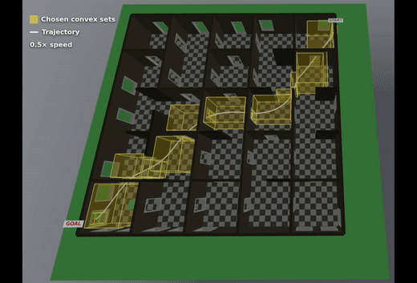

# Neural Graphs of Convex Sets

This repository contains the code associated to our paper [Accelerating Mixed Discrete-Continuous Motion Planning via Neural Graphs of Convex Sets](https://arxiv.org/pdf/2608.15440).

**TL;DR:** We accelerate motion planning in Graphs of Convex Sets by replacing the convex relaxation stage with a Graph Neural Network that predicts edge flows, from which we sample candidate paths. A RankNet-style neural network scores and orders these candidates, allowing us to evaluate convex restrictions sequentially and terminate early at the first feasible solution. We demonstrate the proposed approach on obstacle-free motion planning for a quadrotor and a robotic manipulator, alongside planning through contact.

## Visualizations

### Quadrotor



### Pick and Place


### Box Pushing


### Tee Pushing


## Acknowledgments

We are grateful to the authors of the following papers for making their codebases public. This project builds on their work.
- [Motion Planning around Obstacles with Convex Optimization](https://arxiv.org/abs/2205.04422) 
- [Towards Tight Convex Relaxations for Contact-Rich Manipulation](https://arxiv.org/abs/2402.10312) 
- [Using Graphs of Convex Sets to Guide Nonconvex Trajectory Optimization](https://ieeexplore.ieee.org/document/10802426)

---

## Setup

Tested with Python 3.12 and CUDA 12.1. If your machine uses a different CUDA version, replace `cu121` in the URLs below.

```console
python3.12 -m venv venv
source venv/bin/activate
python3 -m pip install -U pip
pip install torch==2.5.0 --index-url https://download.pytorch.org/whl/cu121
python3 -m pip install -r requirements.txt
python3 -m pip install -e . --no-deps
pip install torch-scatter -f https://data.pyg.org/whl/torch-$(python -c "import torch; print(torch.__version__.split('+')[0])")+cu121.html
```

Download all pretrained checkpoints, datasets, and assets:

```console
bash scripts/download_models.sh
bash scripts/download_data.sh
bash scripts/setup_iiwa_models.sh
```

**Drake / MOSEK:** The quadrotor and GCS examples use Drake's GCS bindings. Install and activate a MOSEK license to reproduce those solver paths exactly.

---

## Benchmarks

Run everything in one go:

```console
bash benchmark_all_gcs.sh
```

Or run per domain:

```console
bash benchmark_quadrotor_gcs.sh
bash benchmark_manipulation_gcs.sh
bash benchmark_ptc_gcs.sh
```

---

## Quadrotor Motion Planning

Demonstrates 3D quadrotor motion planning from a start to a goal pose. It utilizes both convex and non-convex Graphs of Convex Sets (GCS) formulations. Benchmark compares four methods: Vanilla GCS, Neural GCS (GNN only), Neural GCS + RankNet, and FastPathPlanning (non-GCS baseline).

### Generate data

Skip if you already ran Setup (`download_data.sh`). To regenerate HDF5 datasets:

```console
# convex + nonconvex
bash quadrotor/scripts/quadrotor_collect.sh
bash quadrotor/scripts/quadrotor_collect.sh --planners convex
bash quadrotor/scripts/quadrotor_collect.sh --planners nonconvex
```

Requires MOSEK and SNOPT.

### Retrain from scratch

```console
# train Flow GNN + RankNet (convex)
bash quadrotor/scripts/quadrotor_train.sh --planner convex  
# train Flow GNN + RankNet (nonconvex)           
bash quadrotor/scripts/quadrotor_train.sh --planner nonconvex          
```

### Benchmark

```console
bash quadrotor/scripts/quadrotor_benchmark.sh
bash benchmark_quadrotor_gcs.sh --max_instances 10   # profile convex + nonconvex on 10 test instances
```

Results saved to `quadrotor/results/results_table_<planner>.pdf`. Omit `--max_instances` to profile the full test split. Each numeric column reports mean ± std with median on a second line (timing and C_round).

### Visualization

Outputs Meshcat HTML to `quadrotor/results/motion/`.

Replay a saved dataset instance (IDs 0–499 for training, 500–599 for validation, and 600–699 for testing):

```console
python quadrotor/scripts/visualize_quadrotor_motion.py \
  --h5_path quadrotor/dataset/quadrotor_gcs_convex.h5 \
  --instance-id 42 \
  --planner nonconvex \
  --methods neural_ranknet
```

Generate a new scene from seeds (no HDF5):

```console
python quadrotor/scripts/visualize_quadrotor_motion.py \
  --grid-size 5 --building-seed 0 --query-seed 0 \
  --planner nonconvex \
  --methods neural_ranknet
```

---

## Manipulation Motion Planning

The IIWA shelf setup uses IRIS regions in configuration space and trains the same PointNet flow GNN + RankNet stack for convex and nonconvex GCS.

Datasets are at `manipulation/dataset/manipulation_gcs_{convex,nonconvex}.h5`. Checkpoints are at `manipulation/checkpoints/manipulation_{convex,nonconvex}/`.

### Retrain from scratch

```console
bash manipulation/scripts/manipulation_collect.sh                         # convex + nonconvex HDF5
bash manipulation/scripts/manipulation_train.sh --planner convex          # train Flow GNN + RankNet
bash manipulation/scripts/manipulation_train.sh --planner nonconvex
```

### Benchmark

```console
bash manipulation/scripts/manipulation_benchmark.sh --planner convex
bash manipulation/scripts/manipulation_benchmark.sh --planner nonconvex --device cpu
bash benchmark_manipulation_gcs.sh --max_instances 10   # profile convex + nonconvex on 10 test instances
```

The benchmark compares vanilla GCS against Neural GCS + RankNet on the manipulation circle task and writes summaries under `manipulation/results/shelf_viz/circle_demo/`.
The profiling wrapper uses the held-out HDF5 test split and writes PDFs to `manipulation/results/shelf_viz/dataset_benchmark/`. Omit `--max_instances` to profile the full test split. Each numeric column reports mean ± std with median on a second line (timing and cost).

### Visualization

Outputs Meshcat HTML to `manipulation/results/shelf_viz/circle_neural/`.

Convex GCS:

```console
python scripts/visualize_manipulation_circle_neural.py --planner convex
```

Nonconvex GCS:

```console
python scripts/visualize_manipulation_circle_neural.py --planner nonconvex
```

---

## Planning Through Contact

Planar pushing with `sugar_box` and `tee` bodies. Benchmarks Neural GCS against vanilla GCS and a contact-implicit baseline.

### Retrain from scratch

```console
bash planning_through_contact/scripts/ptc_collect.sh --box
bash planning_through_contact/scripts/ptc_train.sh --box
bash planning_through_contact/scripts/ptc_collect.sh --tee
bash planning_through_contact/scripts/ptc_train.sh --tee
```

### Run the full benchmark

```console
bash benchmark_ptc_gcs.sh                              
bash planning_through_contact/scripts/ptc_benchmark.sh --box
bash planning_through_contact/scripts/ptc_benchmark.sh --tee
bash planning_through_contact/scripts/ptc_benchmark.sh --box --skip_trajopt   # skip SNOPT baseline
```

### Visualization

```console
bash planning_through_contact/scripts/ptc_visualize.sh --box
bash planning_through_contact/scripts/ptc_render_figures.sh --box
```

Motion videos are written to `planning_through_contact/results/trajectories/<body>/video_<N>/`.
